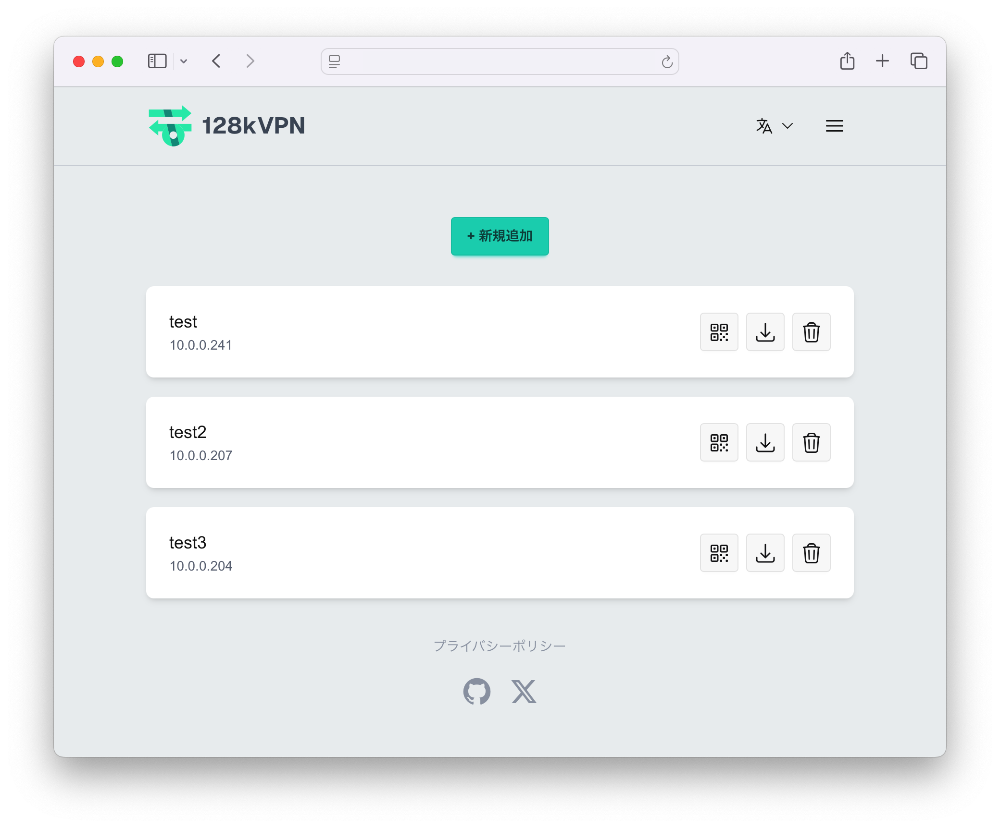
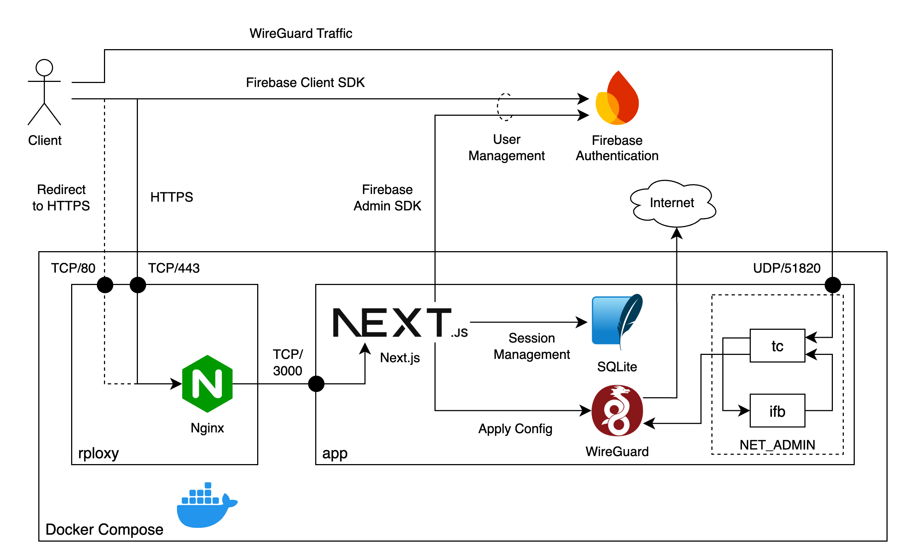

# 128kVPN

<div align="center">
    
    <br>
    Provides a bandwidth-limited environment.
    <br>
    Bandwidth control is implemented via VPN.
    <br>
    <br>
    
</div>

## Features
- Establishes a VPN connection using WireGuard, with all traffic controlled server-side.
- Uses `tc` and the `ifb` module on the server to enforce both upload and download bandwidth limits.
- Bandwidth is limited to 128 kbps for both upload and download.
- Easily and quickly deployable via Next.js and Docker.
- User information is managed using Firebase Authentication.
- Provides management APIs to check and disconnect active sessions.
- Web interface is multilingual.
- Enables HTTPS communication via Nginx as a reverse proxy.

## Architecture
<div align="center">
    
</div>

## Requirements
- Requires Linux to utilize network control features like `tc` and `ifb`.
- Docker is required to run the application.
- You must obtain the Firebase Client SDK config and Admin SDK config in advance and set them in the `.env` file.
- To use the management API, a shared secret must be set in the `.env` file.

## How to deploy

### Linux (Ubuntu etc.)

#### Setup

Install Docker
```sh
curl https://get.docker.com | sudo sh
```

Load `ifb` and `act_mirred`, `ip_tables` module
```sh
sudo modprobe ifb
sudo modprobe act_mirred
sudo modprobe ip_tables
```

Copy the `.env.sample` file and fill in the required information
```sh
cp .env.sample .env
```

Please place the private key (`privkey.pem`) and the server certificate issued by a certificate authority such as Let's Encrypt + intermediate certificate (`fullchain.pem`) in the `nginx` directory.

(In a development environment, use `mkcert` to generate the certificate.)

```sh
cp /path/to/privkey.pem nginx/privkey.pem
cp /path/to/fullchain.pem nginx/fullchain.pem
```

#### Deploy

Build (Dev)
```sh
sudo docker compose -f compose.dev.yml up -d
sudo docker compose -f compose.dev.yml down
```

Build (Prod)
```sh
sudo docker compose up -d
sudo docker compose down
```

Build only `app` (Prod)
```sh
sudo docker compose up -d app
sudo docker compose down
```

### MacOS and Windows

> [!IMPORTANT]
> The GUI works perfectly, but the VPN is not available.

#### Setup

Copy the `.env.sample` file and fill in the required information
```sh
cp .env.sample .env
```

Please start DevContainer.

#### Build

Change to the `src/` directory
```sh
cd src/
```

Install dependencies
```sh
npm install
```

Build (Dev)
```sh
npm run dev
```

Build (Prod)
```sh
npm run build
npm run start
```